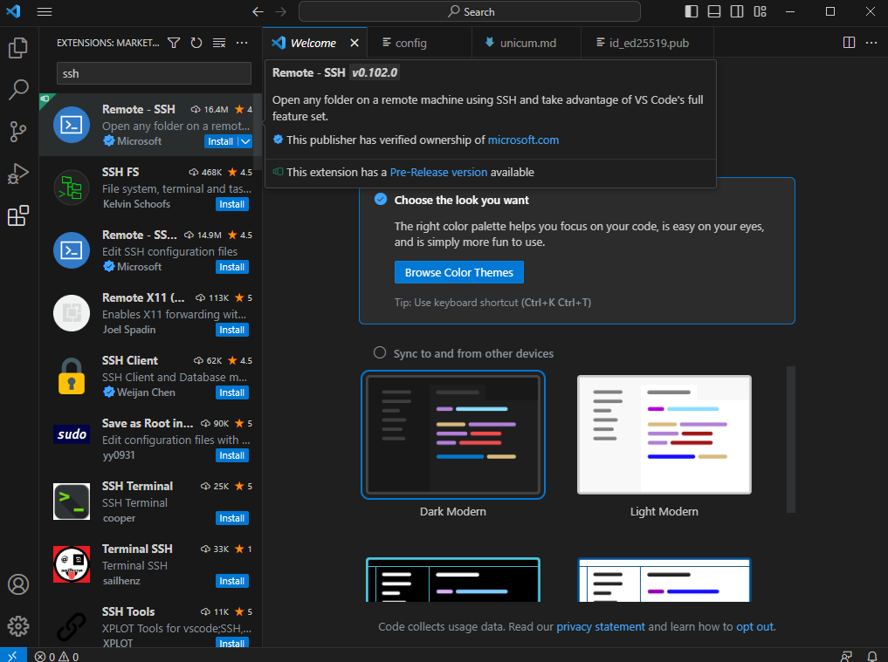
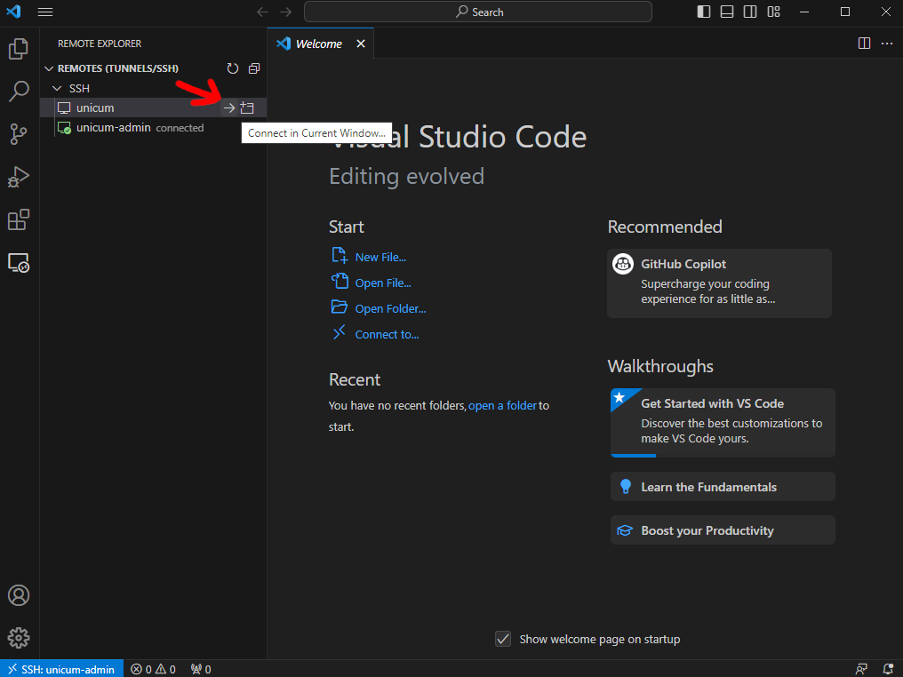

# Configure SSH access

## Linux/MacOS

```shell
ssh-keygen -t ed25519
```

```text
Generating public/private ed25519 key pair.
Enter file in which to save the key (/home/<login name>/.ssh/id_ed25519): 
Enter passphrase (empty for no passphrase): 
Enter same passphrase again: 
Your identification has been saved in /home/<login name>/.ssh/id_ed25519
Your public key has been saved in /home/<login name>/.ssh/id_ed25519.pub
# more stuff...
```

Two files will be generated at the following directory:

```text
C:\Users\<Your windows client username>\.ssh
```

One is your private key: `id_ed25519`, which you must not share with anyone. The other is your public key `id_ed25519.pub` which can be shared with others.

## Windows

Tested for Windows 11 pro.

### Generate assymetric encryption key pair

Open a terminal application. E.g. Press the Windows key and type terminal. Open the terminal app and enter the following command:

```shell
ssh-keygen.exe -t ed25519
```

```text
Generating public/private ed25519 key pair.
Enter file in which to save the key (/home/<login name>/.ssh/id_ed25519): 
Enter passphrase (empty for no passphrase): 
Enter same passphrase again: 
Your identification has been saved in /home/<login name>/.ssh/id_ed25519
Your public key has been saved in /home/<login name>/.ssh/id_ed25519.pub
# more stuff...
```

Two files will be generated at the following directory:

```text
C:\Users\<Your windows client username>\.ssh
```

One is your private key: `id_ed25519`, which you must not share with anyone. The other is your public key `id_ed25519.pub` which can be shared with others.


### Write ssh client config file

```text
Host unicum
    HostName 109.205.181.120
    Port 1122
    IdentityFile ~/.ssh/id_ed25519
    User <Your remote Linux username>
```

Change `User` to your username.

### Ask access to the server

Write a message to one of the system admins with the following:

- The **username** of your desire. It should be simple and easy to remember. There are some rules, so you should test the name out [here](https://regex101.com/r/3dEPhE/1). Copy it into the TEST STRING text box. If it is highlighted enterily, then you are good to go.
- The **public key** that you want to use. Just copy-paste the content of the `id_ed25519.pub` file generated earlier.
- Preferred shell: `bash` or `zsh`?
- Do you want to use docker? Or in general do you need some special privilage?

### Login

Wait until your user is created, to login type this command into your terminal

```shell
ssh unicum
```

# Configure vscode remote access





